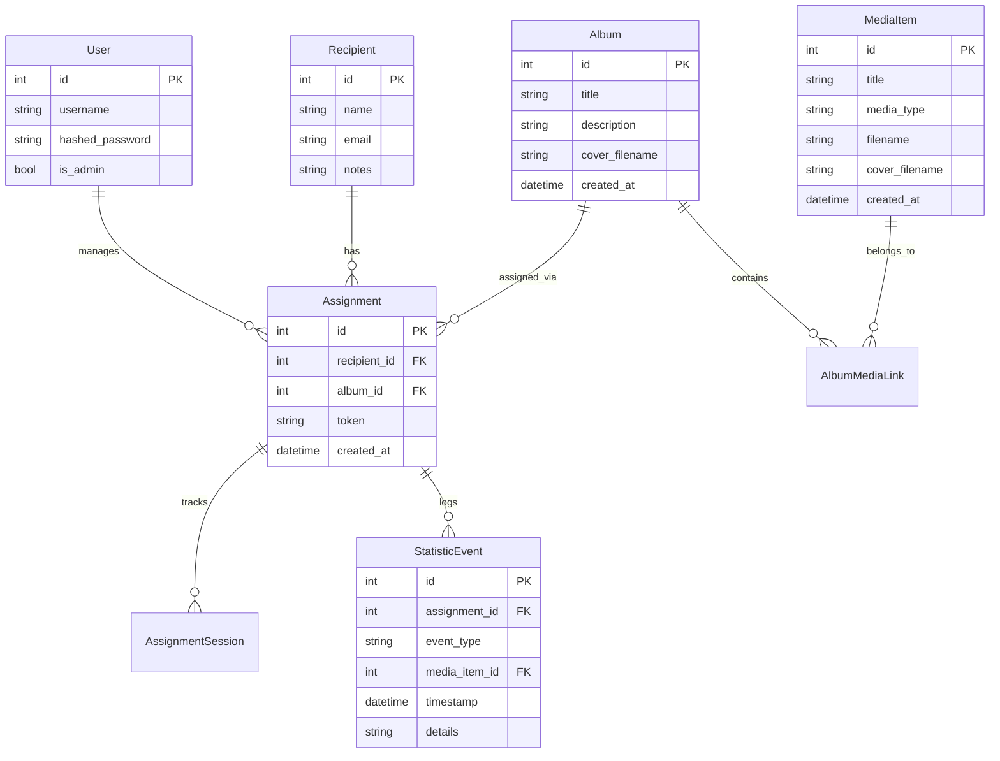

# 🎵 QR Media Admin System

A full-stack web application for managing and distributing audio/video content via QR codes. Create albums, assign them to recipients, generate unique QR codes, and track engagement statistics.


---

## ✨ Features

### 📁 Media Management
- Upload and manage audio/video files
- Add cover art to media items and albums
- Organize media into albums with descriptions

### 👥 Recipient Management
- Create and manage recipients (people who will receive QR codes)
- Add contact information and notes for each recipient

### 🔗 Album Assignments
- Assign albums to recipients with unique tokens
- Generate QR codes that link directly to personalized media players
- Track who has access to which content

### 📊 Statistics & Analytics
- Track views, plays, and user engagement
- Session management to monitor access patterns
- Detailed event logging for media interactions

### 🎨 Public Player
- Beautiful, responsive media player for recipients
- Supports both audio and video playback
- Album cover art display

---

## 🏗️ Architecture

```
┌─────────────────────────────────────────────────────────────────┐
│                         Nginx (Port 80)                          │
│              Reverse Proxy & Static Media Serving                │
└─────────────────────┬───────────────────────────┬───────────────┘
                      │                           │
         ┌────────────▼────────────┐  ┌───────────▼───────────┐
         │   Frontend (React)       │  │   Backend (FastAPI)    │
         │   - Admin Dashboard      │  │   - REST API           │
         │   - Public Player        │  │   - Auth & JWT         │
         │   - Login Page           │  │   - File Management    │
         │   Port: 5173 (dev)       │  │   Port: 8000           │
         └────────────────────────┘  └───────────┬───────────┘
                                                   │
                                       ┌───────────▼───────────┐
                                       │   PostgreSQL (DB)      │
                                       │   Port: 5432           │
                                       └───────────────────────┘
```

---

## 🚀 Quick Start

### Prerequisites
- [Docker](https://www.docker.com/get-started) & Docker Compose
- Git

### Installation

1. **Clone the repository**
   ```bash
   git clone <repository-url>
   cd Jolanda
   ```

2. **Start the application**
   ```bash
   docker-compose up --build
   ```

3. **Access the application**
   - 🌐 **Main Application**: http://localhost
   - 🔧 **Database Admin (Adminer)**: http://localhost:8080

4. **Default Admin Credentials**
   ```
   Username: admin
   Password: admin
   ```
   > ⚠️ **Important**: Change the default credentials in production!

---

## 📁 Project Structure

```
Jolanda/
├── backend/                 # FastAPI Backend
│   ├── main.py             # Application entry point
│   ├── models.py           # SQLModel database models
│   ├── database.py         # Database configuration
│   ├── auth.py             # Authentication utilities
│   ├── routers/            # API route handlers
│   │   ├── admin.py        # Admin CRUD operations
│   │   ├── auth.py         # Login/logout endpoints
│   │   └── public.py       # Public player endpoints
│   ├── media/              # Uploaded media storage
│   ├── requirements.txt    # Python dependencies
│   └── Dockerfile
│
├── frontend/                # React Frontend
│   ├── src/
│   │   ├── pages/
│   │   │   ├── AdminDashboard.tsx  # Admin UI
│   │   │   ├── Login.tsx           # Login page
│   │   │   └── PublicView.tsx      # Public media player
│   │   ├── components/     # Reusable components
│   │   ├── App.tsx         # Main app component
│   │   ├── api.ts          # API client configuration
│   │   └── types.ts        # TypeScript types
│   ├── package.json
│   └── Dockerfile
│
├── nginx/                   # Nginx Configuration
│   └── nginx.conf          # Reverse proxy settings
│
├── media/                   # Shared media storage volume
├── tests/                   # Test files
├── docker-compose.yml       # Docker orchestration
└── README.md
```

---

## 🔧 Configuration

### Environment Variables

| Variable | Default | Description |
|----------|---------|-------------|
| `DATABASE_URL` | `postgresql://postgres:postgres@db:5432/qrmedia` | PostgreSQL connection string |
| `SECRET_KEY` | `supersecretkeychangeinproduction` | JWT signing key |
| `VITE_API_URL` | `/api` | Frontend API base URL |

### Changing Default Credentials

Edit `docker-compose.yml` to modify:
- Database credentials (`POSTGRES_USER`, `POSTGRES_PASSWORD`)
- JWT `SECRET_KEY` (important for security)

---

## 📚 API Endpoints

### Authentication
| Method | Endpoint | Description |
|--------|----------|-------------|
| `POST` | `/api/auth/login` | Admin login |
| `POST` | `/api/auth/logout` | Admin logout |

### Admin Routes (Protected)
| Method | Endpoint | Description |
|--------|----------|-------------|
| `GET/POST` | `/api/admin/media` | List/Upload media items |
| `DELETE` | `/api/admin/media/{id}` | Delete media item |
| `GET/POST` | `/api/admin/albums` | List/Create albums |
| `PUT/DELETE` | `/api/admin/albums/{id}` | Update/Delete album |
| `GET/POST` | `/api/admin/recipients` | List/Create recipients |
| `PUT/DELETE` | `/api/admin/recipients/{id}` | Update/Delete recipient |
| `GET/POST` | `/api/admin/assignments` | List/Create assignments |
| `DELETE` | `/api/admin/assignments/{id}` | Delete assignment |
| `GET` | `/api/admin/statistics` | View usage statistics |

### Public Routes
| Method | Endpoint | Description |
|--------|----------|-------------|
| `GET` | `/api/public/play/{token}` | Get album data for player |
| `POST` | `/api/public/event` | Log playback events |

---

## 🛠️ Development

### Running Locally (Without Docker)

**Backend:**
```bash
cd backend
pip install -r requirements.txt
uvicorn main:app --reload --host 0.0.0.0 --port 8000
```

**Frontend:**
```bash
cd frontend
npm install
npm run dev
```

### Building for Production

```bash
# Build production images
docker-compose build

# Run in detached mode
docker-compose up -d
```

### Viewing Logs

```bash
# All services
docker-compose logs -f

# Specific service
docker-compose logs -f backend
docker-compose logs -f frontend
```

---

## 🗃️ Database Schema



---

## 🔒 Security Considerations

1. **Change Default Credentials**: Update admin password and database credentials before deploying
2. **Update SECRET_KEY**: Use a strong, unique secret key for JWT tokens
3. **HTTPS**: Configure SSL/TLS certificates for production (modify nginx.conf)
4. **File Upload Limits**: Currently unlimited - consider adding restrictions for production
5. **Rate Limiting**: Consider implementing rate limiting on public endpoints

---

## 🐛 Troubleshooting

### Common Issues

**Database connection errors:**
```bash
# Restart database container
docker-compose restart db

# Check database logs
docker-compose logs db
```

**Media files not showing:**
```bash
# Check media volume permissions
docker-compose exec backend ls -la /app/media
```

**Frontend not updating:**
```bash
# Rebuild frontend
docker-compose up --build frontend
```

**Clear everything and start fresh:**
```bash
docker-compose down -v
docker-compose up --build
```

---

## 📝 License

This project is private and proprietary.

---

## 👥 Contributing

1. Create a feature branch
2. Make your changes
3. Test thoroughly
4. Submit a pull request

---

## 📞 Support

For issues and feature requests, please create an issue in the repository.
